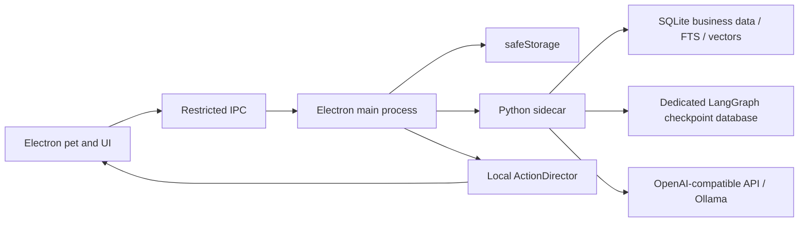

# Everby

English | [Simplified Chinese](README.md)

Everby is a local-first desktop companion for Windows and macOS. Electron provides the transparent desktop pet and management UI, while a Python sidecar handles conversations, tools, memory, and background workflows. Controlled semantic intents are mapped to local frame-by-frame animations.

The current release includes the original character **Daily** and can also discover locally installed Petdex characters. Even when the model is offline, the pet can still walk, idle, respond to clicks, and play local animations.


## Features

- A transparent, always-on-top desktop pet that does not steal focus, with dragging, clicking, walking, and multi-monitor positioning
- Daily and local character switching, with an isolated persona, conversation history, and memory for each character
- Nine transparent frame-animation sets for Daily, including a dedicated coding animation
- OpenAI Chat Completions-compatible APIs with streaming, cancellation, timeouts, and bounded retries
- A LangChain `create_agent` tool loop and LangGraph state graph for conversations, short-term checkpoints, and capability fallback; streaming, tool-calling, and embedding support are probed whenever model settings change
- Up to three images can be selected or pasted into a conversation; the chat model invokes a separately configured vision model through the scoped `inspect_image` tool when needed
- A response-goal analysis step before generation and a quality gate afterward; repeated introductions, repetitive forms of address, and generic companion phrases are repaired deterministically or sent through a controlled rewrite node before persistence
- Python background scheduling for deterministic reminders, proactive companionship, and long-term memory curation
- Local to-do lists, one-time or daily reminders, and low-frequency AI follow-up on upcoming tasks
- SQLite FTS5 plus vector-based long-term memory, with separate API keys protected by Electron `safeStorage`
- A visual animation library, a default Normal mode, user-created removable modes, per-character event rules, and `.soulmotion` extension management
- An ActionDirector that uses time budgets to control active animation ratios, with fixed or weighted animation pools, per-mode event overrides, and fallback for unavailable extension actions; the Daily example extension and six event rules are initialized on first launch
- A yellow-and-white management UI, chat bubbles, and tray controls

## Quick Start

Requirements: Node.js 24+, pnpm 11+, and Python 3.10+.

```bash
pnpm install --frozen-lockfile
python -m pip install -r agent/requirements-runtime.txt
pnpm agent:test
pnpm dev
```

After the first launch, open the **Characters** page in the management window to switch between Daily and locally installed Petdex characters. See below for character and animation import workflows.

## Basic Interaction and Customization

- **Left-click** the pet to trigger the interaction assigned to the current mode. Hold and move with the left mouse button to drag it.
- **Right-click** the pet to open chat. The tray icon can also open chat, open settings, or quit Everby.
- The **Companion** page controls visibility, background-animation pause, proactive messages, and custom mode sessions. Pausing stops background rotation only; click, reminder, and drag feedback remain active.
- The **Characters** page switches characters and edits the name, user address, background, speaking style, and behavior boundaries. Each character has isolated persona, conversation, plan, and memory data.
- The **Appearance** page controls pet scale and always-on-top behavior. Dragged positions are persisted and constrained to the multi-monitor work area.

The **Animations** page has four views:

| View | Configuration |
| --- | --- |
| Animation Library | Inspect base and extension actions, including source, loop behavior, duration, and intent, then preview them on the Canvas or desktop |
| Modes | The non-removable **Normal** mode is the only default; create custom modes with an activity ratio, fixed action or weighted pool, action duration, default session duration, and per-mode click/conversation/reminder actions |
| Event Rules | Map click, conversation intent, or reminder events to actions with enable state, probability, cooldown, and loop duration |
| Extension Packs | Import, enable, disable, or remove `.soulmotion` packages; disabled references are retained and recover when the package is enabled again |

## Importing Characters and Animations

### Import a Character

1. Open **Characters -> Import Character** and select a Petdex character directory or `.zip` archive. Once validation succeeds, Everby installs and activates it immediately without a restart.
2. Alternatively, copy the character directory to `~/.petdex/pets/` and restart Everby. Set `EVERBY_PETDEX_ROOT` to use a different location.

Everby rejects duplicate character IDs instead of overwriting them and never modifies the original external directory. See [docs/pet-format.md](docs/pet-format.md) for the directory layout, `pet.json`, persona fields, and 8x9 animation atlas format.

### Import an Animation Extension

Additional animations are installed as `.soulmotion` extensions and do not modify the character's base atlas:

1. Open **Animations -> Extension Packs -> Import .soulmotion** and select the package.
2. Each package can be enabled, disabled, or removed per character. Disabled animations remain in the library but are not selected for playback.

The bundled `examples/motions/daily-routines.soulmotion` package is installed for Daily on first launch. Authors can use the CLI validation and packaging commands described under [Development and Validation](#development-and-validation). Format and security constraints are documented in [docs/soulmotion-format.md](docs/soulmotion-format.md).

### Create Characters and Animations with Codex Skills

The [`skills/`](skills/) directory contains three Codex Skills for Everby asset workflows. They are more than prompt templates: each Skill defines when it applies, the ordered workflow, validation rules, and executable helper scripts that Codex can use to complete the task.

#### Install and Enable the Skills

Open the Everby repository in Codex and run `pnpm install` from the repository root. Then copy or link each complete Skill directory, including its `SKILL.md` and `scripts/`, into `~/.codex/skills/`:

```powershell
# Windows PowerShell
New-Item -ItemType Directory -Force "$HOME\.codex\skills"
Copy-Item -Recurse -Force .\skills\everby-* "$HOME\.codex\skills\"
```

```bash
# macOS / Linux
mkdir -p ~/.codex/skills
cp -R skills/everby-* ~/.codex/skills/
```

Start a new Codex task after installation so the Skills are reloaded. You can describe the task naturally and let Codex select a Skill from its `description`, or explicitly invoke one by starting the prompt with `$skill-name`.

#### Create a New Character from Images

Use [everby-pet-from-image](skills/everby-pet-from-image/SKILL.md). Provide one or more reference images and specify the character ID, display name, visual style, and persona requirements:

```text
$everby-pet-from-image
Turn this reference into a chibi pixel-art Everby pet.
Use nu-gundam as the ID, Nu Gundam as the name, and a calm, concise personality.
```

Codex first determines whether the source is an existing sprite sheet that can be rearranged or character art that must be adapted. For character art, it keeps the design consistent while producing the nine animation rows: idle, walking in both directions, waving, jumping, failure, stretching, working, and reviewing. Each row is reviewed before continuing. Codex then cleans color spill, assembles the 8x9 atlas, writes the `persona` block, and runs format validation. The result is a character directory containing `pet.json` and `spritesheet.webp`, ready for **Characters -> Import Character**.

#### Validate and Install an Existing Character

Use [everby-pet-install](skills/everby-pet-install/SKILL.md). The input can be a Petdex character directory or ZIP archive:

```text
$everby-pet-install validate and install C:\Downloads\lulu-capybara.zip
```

Codex locates the actual character root and checks `pet.json`, the character ID, atlas filename, and 8x9 grid dimensions. It can repair a missing manifest or incorrect filename. If the atlas dimensions are invalid, it stops and reports the mismatch instead of stretching the image and breaking frame coordinates. Valid characters are installed to `~/.petdex/pets/<id>`. Codex asks before replacing an existing ID and does not silently overwrite source files.

#### Build an Animation Extension for an Existing Character

Use [everby-motion-pack](skills/everby-motion-pack/SKILL.md). Describe the target character, visual behavior, trigger intent, and whether the animation should loop:

```text
$everby-motion-pack
Create a one-shot animation where Daily looks annoyed after repeated clicks.
Use the confused intent.
```

Codex designs the animation ID and intent, generates or arranges transparent 192x208 frames, creates and completes `motion.json`, and runs `motion:build` followed by `motion:validate`. The result is an importable `.soulmotion` package. After installing it from **Animations -> Extension Packs**, preview it in the animation library and add it to a mode pool or bind it to click, conversation, or reminder events.

Use `everby-pet-from-image` to create a complete character, `everby-pet-install` to install or repair an existing character, and `everby-motion-pack` only to add animations to an existing character. Run all helper scripts from the Everby repository root. A workflow is complete only when character validation returns `ok: true` or `motion:validate` succeeds.

## Model Configuration

Configure separate OpenAI-compatible chat, image-understanding, and embedding services on the **Model** page. Each can use a different endpoint, model, and encrypted API key:

| Setting | OpenAI example | Ollama example |
| --- | --- | --- |
| API Base URL | `https://api.openai.com/v1` | `http://127.0.0.1:11434/v1` |
| Model | `gpt-4.1-mini` | `llama3.2:latest` |
| API Key | Key from your provider | `ollama` |

To test with a local Ollama instance:

```bash
ollama pull llama3.2:latest
ollama serve
EVERBY_MODEL=llama3.2:latest pnpm agent:smoke
```

API keys are encrypted with macOS Keychain or Windows DPAPI. They are never returned to the renderer over IPC and should not be stored in `.env` files or committed to the repository.

After saving and testing the image-understanding model, select images or paste screenshots into the chat composer. Electron validates and compresses each image without exposing its local path. Images do not bypass the conversation workflow: a tool-capable chat model calls `inspect_image` when the answer depends on visual content, then uses the returned observation to write the final response.

## Plans and Reminders

Use the **Plans** page to create, complete, or delete items and configure separate due and reminder times. Reminders can run once or repeat daily. System notifications, pet bubbles, and local responses remain available even when the model is offline.

You can also say, "Remind me to drink water at 3 PM," "Add the weekly report to my plans," or "Mark the weekly report as complete" in chat. The Python agent exposes create and complete tools but no delete tool, and it must retrieve the exact item ID before completing one. If the model does not support tool calling, Everby falls back to companion chat while retaining memory recall.

Reminder timing is determined by the Python scheduler from SQLite timestamps, never by the model. Once an item is due, the model may rewrite the copy in the character's voice; a deterministic message is used when the model is unavailable. One due event drives the system notification, pet bubble, and reminder action so chat and proactive events cannot duplicate playback. AI task review considers approaching or overdue deadlines only and does not report a separate future reminder as already due.

## Agent and Memory

### LangGraph Conversation Workflow

Python runs the main conversation as an explicit state graph:

```text
load_context -> analyze_turn -> hybrid_memory_recall -> capability_route
             -> companion_agent / direct_chat
             -> reply_quality_gate -> repair_reply / rewrite_reply
             -> persist_turn -> select_action -> enqueue_memory_curation
```

`analyze_turn` decides whether the turn is ordinary companionship, a question, or an operation. The post-generation quality gate checks repeated introductions, repeated forms of address, generic companion copy, and claims that an operation succeeded without tool evidence. The full path uses LangChain `create_agent`, limits tool-loop recursion to 10 (a graceful fallback reply is returned instead of a failed send when the limit is hit), allows at most two writes per turn, and applies a 45-second timeout. To-do writes are idempotent by `run_id + tool_call_id`; durable facts are deduplicated by exact content or vector similarity.

The model has seven scoped companion tools by default. An eighth image tool is added only after vision capability succeeds:

| Tool | Purpose |
| --- | --- |
| `get_current_time` | Return the current date, time, timezone, and timestamp in the user's timezone |
| `list_todos` | List the current character's plans and obtain the exact ID required for completion |
| `create_todo` | Create a plan or reminder, reusing an active duplicate title and filling missing schedule data |
| `complete_todo` | Complete an item by exact ID; `list_todos` must run first |
| `search_memories` | Search the current character's durable memories when automatic recall is insufficient |
| `remember_memory` | Immediately store a durable fact only after an explicit request to remember it |
| `request_pet_action` | Request at most one semantic gesture per turn; concrete animation IDs remain under Electron `ActionDirector` control |
| `inspect_image` | Inspect only images attached by the user in the current turn through the separate vision model and return an untrusted visual observation |

There are no model tools for deleting plans or memories, choosing concrete animation IDs, file access, shell execution, application control, or arbitrary networking. Streaming, tool-calling, image-understanding, and embedding support are probed independently. Models without native tool calling enter `direct_chat`: companion chat and existing memory recall remain available, deterministic keyword action selection acts as a fallback, and the native tool loop, image inspection, and automatic memory curation are disabled.

### Short-Term and Long-Term Memory

- **Short-term memory:** each character and conversation epoch receives an isolated LangGraph thread ID persisted by `AsyncSqliteSaver` in a dedicated checkpoint database. At roughly 4,000 tokens, old context is summarized while the latest 20 messages are retained. Clearing a conversation increments the epoch without deleting long-term memory.
- **Long-term memory:** seven structured fact types are supported: preference, identity, goal, project, habit, relationship, and commitment. An explicit "remember" request writes immediately. After a successful reply from a tool-capable model, a 30-second debounce starts asynchronous curation over the latest six messages.
- **Safety filtering:** credentials, passwords, API keys, transient small talk, and model-inferred sensitive attributes are rejected. Facts of the same type with vector similarity of at least `0.92` are merged.
- **Hybrid retrieval:** SQLite FTS5 and float32 vectors stored as BLOBs each contribute eight candidates. RRF with `k=60` fuses them into the top five results. If embeddings are unavailable, FTS recall remains available and chat is not blocked.
- **Visual management:** the **Memory** page shows type, confidence, creation time, and vector index status and can delete one fact or clear all long-term memory for the current character.

## Architecture



- `electron/`: window lifecycle, IPC, secure storage, character catalog, and animation package services
- `agent/`: Python LangChain/LangGraph agent, tools, memory, persistence, scheduling, and protocol v2
- `src/core/`: ActionDirector, mode profiles, playback queue, timeline, and semantic-intent mapping
- `src/renderer/`: desktop pet, chat, and management interfaces
- `resources/runtime-pets/`: built-in character assets distributed with the app
- `resources/pet-qa/`: animation contact sheets and validation results for original characters
- `docs/`: animation extension and character format documentation

## Development and Validation

```bash
pnpm typecheck       # TypeScript type checking
pnpm test            # Vitest unit and integration tests
pnpm test:e2e        # Playwright Electron end-to-end tests
pnpm agent:test      # Python agent tests
pnpm build           # Electron renderer and main-process build
```

In development, Electron starts `python3 agent/main.py`. Set `EVERBY_PYTHON` to select a different Python interpreter.

See [docs/soulmotion-format.md](docs/soulmotion-format.md) for animation package format and security requirements:

```bash
pnpm motion:validate -- path/to/motion.soulmotion
pnpm motion:build -- path/to/motion-directory output.soulmotion
```

See [docs/pet-format.md](docs/pet-format.md) for the character directory, `pet.json`, and 8x9 atlas format. The three Codex Skills described above can create, validate, and package these assets.

Additional character animations should be added as `.soulmotion` packages instead of modifying the base atlas. The model emits semantic intents only; Electron's `ActionDirector` handles state time budgets, animation weights, event priorities, and fallbacks. The default **Normal** mode cannot be deleted, while users can create custom modes with their own duration, background animation pool, and click, conversation, or reminder actions. Left-click the pet to play an interaction, drag with the left mouse button to move it, and right-click to open chat.

## Packaging

Install PyInstaller before creating release packages:

```bash
python -m pip install -r agent/requirements-build.txt
pnpm dist:mac:arm64
pnpm dist:mac:x64
pnpm dist:win
```

PyInstaller cannot cross-compile across operating systems or architectures, so each package must be built on the matching runner. On every push to `main`, `.github/workflows/build.yml` verifies macOS arm64, macOS x64, and Windows x64 by running Python tests, type checking, Vitest, and packaging in sequence. The initial release does not include code signing, automatic updates, or installer notarization.

## Data and Privacy

Application data is stored under Electron's `userData` directory. Python exclusively owns messages, personas, to-dos, memories, and workflow data, with LangGraph checkpoints stored in a separate SQLite database to avoid write-lock contention. Electron stores desktop settings, animation packages, and non-secret model configuration only. Chat, image-understanding, and embedding API keys are encrypted separately with `safeStorage` and sent to Python memory only after startup.

Foreground application awareness is disabled by default. When enabled, Everby reads only the application name, not window titles, URLs, filenames, screenshots, or window contents, and application names are not written to the database. Lock-screen, paused, and do-not-disturb states suppress proactive model calls. Foreground awareness can be disabled at any time from the **Privacy** page.

## Character Assets

Daily is Everby's original built-in character. Its runtime atlas and QA materials are included in this repository. View all nine animation groups in the [Daily animation contact sheet](resources/pet-qa/daily/contact-sheet.png).

External character assets are not covered by Everby's license and are not copied into the source repository. Confirm the applicable asset license before contributing or publishing additional characters.

## Troubleshooting

- **Chat works, but plans cannot be created:** click **Probe Capabilities** on the **Model** page. Models without native tool calling run in degraded mode; switch to a compatible OpenAI-style model for the complete tool loop.
- **Images attach but cannot be inspected:** save and test the image-understanding model, then confirm that chat-model tool calling also passes its probe. The `direct_chat` fallback does not run image tools.
- **An installed animation extension does not play:** verify that its `targetPetId` matches the current character, the pack is enabled, and the action works in the library preview. Event playback also requires a per-mode override or event rule.
- **The Python sidecar does not start:** install `agent/requirements-runtime.txt` and set `EVERBY_PYTHON` to a Python 3.10+ interpreter when necessary.
- **Character or animation import fails:** run the `everby-pet-install` validation script or `pnpm motion:validate` to see the exact atlas, manifest, or resource-path error.

## Contributing

Issues and pull requests are welcome. Before submitting, run at least `pnpm agent:test`, `pnpm typecheck`, `pnpm test`, and `pnpm build`. Include `pnpm test:e2e` for Electron interaction changes and a successful `pnpm motion:validate` result for `.soulmotion` changes. Character and animation assets must document their source and license; do not submit third-party IP assets without confirmed permission.

## Project Status

Everby is still in its initial development stage. Before a public release, add code signing and installer notarization and distribute packages through GitHub Releases instead of committing `release/` artifacts to the source repository.

## License

Everby source code and the original Daily assets in this repository are licensed under the [MIT License](LICENSE). Characters installed separately through Petdex and other explicitly identified third-party assets are not covered by this license and remain subject to their own terms.
