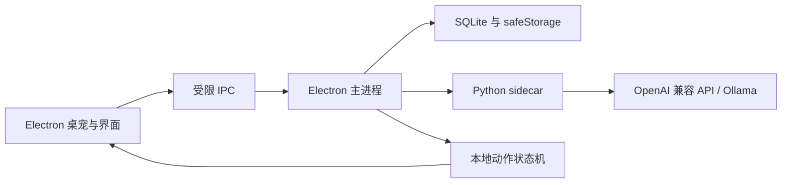

# SoulDesk

SoulDesk 是一个面向 Windows 与 macOS 的本地优先桌面陪伴智能体。它使用 Electron 提供透明桌宠窗口和管理界面，以 Python sidecar 负责对话、记忆摘要与行为规划，并将大模型输出的受控语义意图映射为本地逐帧动画。

当前版本内置原创角色 **Daily**，也能发现用户自行安装的 Petdex 角色。模型离线时，角色仍可走动、待机、响应点击和播放本地动作。


## 主要功能

- 透明、置顶且不抢焦点的桌宠窗口，支持拖动、点击、走动和跨显示器定位
- Daily 与本地角色切换，每个角色拥有独立人设、对话记录和记忆
- Daily 的九组透明逐帧动画，包括专属的电脑敲代码动作
- OpenAI Chat Completions 兼容接口，支持流式回复、取消、超时和有限重试
- Python 智能体负责对话、滚动摘要和受 Zod 约束的行为决策
- 本地待机调度、主动陪伴、免打扰时段和低频模型动作选择
- SQLite 本地记忆与 Electron `safeStorage` API Key 保护
- `.soulmotion` 动作扩展包的验证、安装、启停和卸载
- 黄色与白色为主的管理界面、聊天气泡和托盘控制

## 快速开始

需要 Node.js 24+、pnpm 11+ 和 Python 3.9+。

```bash
pnpm install --frozen-lockfile
pnpm agent:test
pnpm dev
```

首次启动后，可在管理窗口的“角色”页面切换 Daily 或本机已有的 Petdex 角色。SoulDesk 只读扫描 `~/.petdex/pets`，不会修改外部角色的安装目录或原始资源。

## 配置模型

在“模型”页面填写 OpenAI 兼容服务：

| 设置 | OpenAI 示例 | Ollama 示例 |
| --- | --- | --- |
| API Base URL | `https://api.openai.com/v1` | `http://127.0.0.1:11434/v1` |
| 模型 | `gpt-4.1-mini` | `llama3.2:latest` |
| API Key | 服务商提供的 Key | `ollama` |

本地 Ollama 测试：

```bash
ollama pull llama3.2:latest
ollama serve
SOULDESK_MODEL=llama3.2:latest pnpm agent:smoke
```

API Key 由 macOS Keychain 或 Windows DPAPI 加密保存，不会通过 IPC 返回给渲染进程，也不应写入 `.env` 或提交到仓库。

## 架构



- `electron/`：窗口生命周期、IPC、安全存储、角色目录和动作包服务
- `agent/`：Python 对话、行为规划与摘要服务
- `src/core/`：时间线、动作意图映射和清单校验
- `src/renderer/`：桌宠、聊天和管理界面
- `resources/runtime-pets/`：可随应用分发的内置角色资源
- `resources/pet-qa/`：原创角色的动画检查图与验证结果
- `docs/`：动作扩展格式等开发文档

## 开发与验证

```bash
pnpm typecheck       # TypeScript 类型检查
pnpm test            # Vitest 单元与集成测试
pnpm test:e2e        # Playwright Electron 端到端测试
pnpm agent:test      # Python 智能体测试
pnpm build           # Electron 渲染与主进程构建
```

开发态由 Electron 启动 `python3 agent/main.py`。可使用 `SOULDESK_PYTHON` 指定 Python 解释器。

动作扩展格式和安全约束见 [docs/soulmotion-format.md](docs/soulmotion-format.md)：

```bash
pnpm motion:validate -- path/to/motion.soulmotion
pnpm motion:build -- path/to/motion-directory output.soulmotion
```

## 打包

发布构建需要先安装 PyInstaller：

```bash
python -m pip install -r agent/requirements-build.txt
pnpm dist:mac:arm64
pnpm dist:mac:x64
pnpm dist:win
```

PyInstaller 不支持跨系统或跨架构编译，请在对应的 macOS 或 Windows runner 上构建。GitHub Actions 工作流位于 `.github/workflows/build.yml`。当前第一版不包含代码签名、自动更新和安装包公证。

## 数据与隐私

应用数据位于 Electron `userData` 目录。聊天、摘要、人设和设置保存在本机 SQLite 数据库中。前台应用感知默认关闭；开启后只读取应用名称，不读取窗口标题、URL、文件名、屏幕或窗口内容，且应用名称不会写入数据库。

锁屏、暂停和免打扰期间不会触发主动模型调用。前台应用感知可以随时在“隐私”页面关闭。

## 角色资源

Daily 是 SoulDesk 的原创内置角色，其运行图集与 QA 资料保存在本仓库。完整九组动作可在 [Daily 动作检查图](resources/pet-qa/daily/contact-sheet.png) 中查看。

外部角色资源不包含在 SoulDesk 的授权范围内，也不会被复制进源码仓库。贡献或发布其他角色前，请先确认对应素材的授权范围。

## 当前状态

SoulDesk 仍处于第一版开发阶段。建议在公开发布前补充代码签名和安装包公证，并通过 GitHub Release 分发构建产物，不要把 `release/` 直接提交到源码仓库。

## 许可证

SoulDesk 源码与仓库内的原创 Daily 资源采用 [MIT License](LICENSE)。通过 Petdex 单独安装的角色及其他明确标注的第三方资源不包含在该授权范围内，请遵循各自的许可条款。
