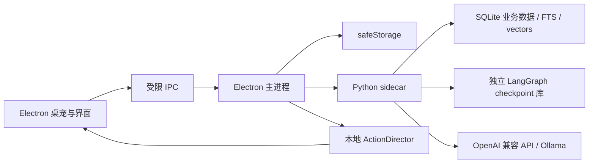

# Everby（常伴）

Everby 是一个面向 Windows 与 macOS 的本地桌面陪伴智能体。它使用 Electron 提供透明桌宠窗口和管理界面，以 Python sidecar 负责对话、工具、记忆与后台工作流，并将受控语义意图映射为本地逐帧动画。

当前版本内置原创角色 **Daily**，也能发现用户自行安装的 Petdex 角色。模型离线时，角色仍可走动、待机、响应点击和播放本地动作。


## 主要功能

- 透明、置顶且不抢焦点的桌宠窗口，支持拖动、点击、走动和跨显示器定位
- Daily 与本地角色切换，每个角色拥有独立人设、对话记录和记忆
- Daily 的九组透明逐帧动画，包括专属的电脑敲代码动作
- OpenAI Chat Completions 兼容接口，支持流式回复、取消、超时和有限重试
- LangChain `create_agent` 与 LangGraph 状态图负责对话、工具循环、短期 checkpoint 和能力降级；每次模型配置后自动探测流式、工具与向量能力
- 对话图在生成前分析本轮响应目标，生成后经过质量门；自我介绍、重复称呼与空泛陪伴话术会被确定性修复或进入受控重写节点，再持久化到会话
- Python 后台调度负责确定性提醒、主动陪伴与长期记忆整理
- 本地计划清单、一次性或每日提醒，以及低频 AI 清单关注
- SQLite FTS5 + 向量长期记忆与 Electron `safeStorage` 双 API Key 保护
- 可视化动作库、常态/专注/休息状态模式、按角色事件规则，以及 `.soulmotion` 扩展包管理
- 动作导演通过时间预算控制非待机占比；专注模式以三分钟坐姿工作长段为主，Daily 示例扩展、三组状态配置与六条事件规则会在首次启动时初始化
- 黄色与白色为主的管理界面、聊天气泡和托盘控制

## 快速开始

需要 Node.js 24+、pnpm 11+ 和 Python 3.10+。

```bash
pnpm install --frozen-lockfile
python -m pip install -r agent/requirements-runtime.txt
pnpm agent:test
pnpm dev
```

首次启动后，可在管理窗口的“角色”页面切换 Daily 或本机已有的 Petdex 角色。导入新角色与动作扩展的方式见下文。

## 导入角色与动作

### 导入角色

1. 管理窗口 → **角色** → **导入角色**，选择 Petdex 角色文件夹或 `.zip` 压缩包，校验通过后立即生效并自动切换，无需重启。
2. 也可以手动把角色目录复制到 `~/.petdex/pets/`（可用 `EVERBY_PETDEX_ROOT` 修改路径），重启后生效。

同名角色已存在时导入会被拒绝，不会覆盖；Everby 不会修改外部角色目录中的已有内容。角色格式（目录结构、pet.json、persona 人设块、8×9 动画图集）见 [docs/pet-format.md](docs/pet-format.md)。

### 导入动作扩展

新动作统一以 `.soulmotion` 扩展包追加，不修改基础角色图集：

1. 管理窗口 → **动作** → **扩展包** → **导入 .soulmotion**，选择扩展包文件即可安装。
2. 每个扩展包可按角色启用、停用或卸载；停用后动作保留在库里，但不参与播放。

仓库附带的 `examples/motions/daily-routines.soulmotion` 会在首次启动时为 Daily 自动安装。动作包作者可以使用 CLI 校验与打包（见“开发与验证”），格式与安全约束见 [docs/soulmotion-format.md](docs/soulmotion-format.md)。

### 用 Codex Skills 创建角色与动作包

仓库的 [`skills/`](skills/) 目录提供三个面向 Everby 资源工作流的 Codex Skill。它们不是聊天提示词模板：每个 Skill 都定义了适用场景、处理步骤、校验规则和可执行脚本，Codex 会按任务选择并完成对应工作流。

#### 安装与启用

先在 Codex 中打开 Everby 仓库，并在仓库根目录执行 `pnpm install`。然后将需要的完整 Skill 目录（必须包含 `SKILL.md` 和 `scripts/`）复制或链接到 `~/.codex/skills/`：

```powershell
# Windows PowerShell
New-Item -ItemType Directory -Force "$HOME\.codex\skills"
Copy-Item -Recurse -Force .\skills\everby-* "$HOME\.codex\skills\"
```

```bash
# macOS / Linux
mkdir -p ~/.codex/skills
cp -R skills/everby-* ~/.codex/skills/
```

安装后新建一个 Codex 任务以重新加载 Skills。日常使用时可以直接描述需求，让 Codex 根据 `description` 自动选择 Skill；需要明确指定时，在提示词开头写 `$Skill名称`。

#### 从图片创建新角色

使用 [everby-pet-from-image](skills/everby-pet-from-image/SKILL.md)。提供一张或多张角色参考图，并说明角色 ID、显示名称、画风和人设要求：

```text
$everby-pet-from-image
把这张参考图制作成 Q 版像素风 Everby 桌宠。
角色 ID 为 nu-gundam，名称为 Nu Gundam，性格冷静简练。
```

Codex 会先判断素材是可以直接重切的精灵图，还是需要重新设计的立绘；只有立绘时会先统一角色造型，再逐行制作待机、行走、挥手、跳跃、失落、伸展、工作和检查等 9 组动画。每行确认后才继续，最后清理背景溢色、组装为 8×9 图集、写入 `persona`，并运行格式校验。产物是包含 `pet.json` 与 `spritesheet.webp` 的角色目录，可在“角色 → 导入角色”中直接选择。

#### 校验并安装现成角色

使用 [everby-pet-install](skills/everby-pet-install/SKILL.md)。输入可以是 Petdex 角色文件夹或 ZIP：

```text
$everby-pet-install 校验并安装 C:\Downloads\lulu-capybara.zip
```

Codex 会定位真正的角色根目录，检查 `pet.json`、角色 ID、图集文件名和 8×9 网格尺寸。缺少清单或文件名不规范时可以修复；图集尺寸错误时会停止并报告，不会强行缩放导致切片错位。校验通过后安装到 `~/.petdex/pets/<id>`，同名角色存在时会先询问，不会静默覆盖原文件。

#### 为已有角色制作动作扩展

使用 [everby-motion-pack](skills/everby-motion-pack/SKILL.md)。说明目标角色、动作表现、触发语义以及是否循环：

```text
$everby-motion-pack
给 Daily 制作一个被连续点击时显得不耐烦的动作，单次播放，语义使用 confused。
```

Codex 会设计动作 ID 和语义，从参考素材生成或整理为 192×208 的透明帧，生成并完善 `motion.json`，再执行 `motion:build` 与 `motion:validate`。最终产物是可导入的 `.soulmotion` 文件；在“动作 → 扩展包”安装后，可以在动作库预览，并加入状态动作池或绑定到点击、对话和提醒事件。

三个 Skill 的边界是：创建完整角色用 `everby-pet-from-image`，安装或修复现成角色用 `everby-pet-install`，给已有角色追加动作才用 `everby-motion-pack`。所有脚本都应从 Everby 仓库根目录运行，只有校验结果为 `ok: true` 或 `motion:validate` 通过才算完成。

## 配置模型

在“模型”页面分别填写 OpenAI 兼容的聊天与 Embedding 服务。Embedding 使用独立配置和独立加密 API Key：

| 设置 | OpenAI 示例 | Ollama 示例 |
| --- | --- | --- |
| API Base URL | `https://api.openai.com/v1` | `http://127.0.0.1:11434/v1` |
| 模型 | `gpt-4.1-mini` | `llama3.2:latest` |
| API Key | 服务商提供的 Key | `ollama` |

本地 Ollama 测试：

```bash
ollama pull llama3.2:latest
ollama serve
EVERBY_MODEL=llama3.2:latest pnpm agent:smoke
```

API Key 由 macOS Keychain 或 Windows DPAPI 加密保存，不会通过 IPC 返回给渲染进程，也不应写入 `.env` 或提交到仓库。

## 计划与提醒

可在管理窗口的“计划”页面添加、完成或删除清单项，并分别设置截止时间和提醒时间。提醒支持一次性与每日重复；即使模型离线，到点后的系统通知、桌宠气泡和本地响应仍然可用。

也可以直接在对话中提出“下午三点提醒我喝水”“把整理周报加入计划”或“完成整理周报”。Python 智能体只暴露新增与完成工具，不提供删除工具；完成项目前必须先查询准确 ID。模型不支持工具调用时会降级为纯陪伴聊天，已有记忆召回仍可用。

## 架构



- `electron/`：窗口生命周期、IPC、安全存储、角色目录和动作包服务
- `agent/`：Python LangChain/LangGraph 智能体、工具、记忆、持久化、调度和 protocol v2
- `src/core/`：时间线与动作意图映射
- `src/renderer/`：桌宠、聊天和管理界面
- `resources/runtime-pets/`：可随应用分发的内置角色资源
- `resources/pet-qa/`：原创角色的动画检查图与验证结果
- `docs/`：动作扩展格式等开发文档

## 开发与验证

```bash
pnpm typecheck       # TypeScript 类型检查
pnpm test            # Vitest 单元与集成测试
pnpm test:e2e        # Playwright Electron 端到端测试
pnpm agent:test      # Python 智能体测试
pnpm build           # Electron 渲染与主进程构建
```

开发态由 Electron 启动 `python3 agent/main.py`。可使用 `EVERBY_PYTHON` 指定 Python 解释器。

动作扩展格式和安全约束见 [docs/soulmotion-format.md](docs/soulmotion-format.md)：

```bash
pnpm motion:validate -- path/to/motion.soulmotion
pnpm motion:build -- path/to/motion-directory output.soulmotion
```

角色格式（目录结构、pet.json、8×9 图集网格）见 [docs/pet-format.md](docs/pet-format.md)；用 AI 创建角色与动作包的三个 Codex skills 见上文“导入角色与动作”。

后续角色动作统一以 `.soulmotion` 扩展包追加，不直接修改基础角色图集。模型只输出语义意图，Electron 的 `ActionDirector` 统一处理状态时间预算、动作权重、事件优先级和回退。默认只有不可删除的“常规”状态，用户可以创建带独立时长、背景动作池以及点击、对话、提醒动作的自定义状态。左键点击桌宠播放互动动作，左键移动用于拖拽，右键打开聊天。

## 打包

发布构建需要先安装 PyInstaller：

```bash
python -m pip install -r agent/requirements-build.txt
pnpm dist:mac:arm64
pnpm dist:mac:x64
pnpm dist:win
```

PyInstaller 不支持跨系统或跨架构编译，请在对应的 macOS 或 Windows runner 上构建。GitHub Actions 工作流位于 `.github/workflows/build.yml`。当前第一版不包含代码签名、自动更新和安装包公证。

## 数据与隐私

应用数据位于 Electron `userData` 目录。Python 独占消息、人设、待办、记忆与工作流数据，并使用同目录的独立 SQLite 文件保存 LangGraph checkpoint，避免与业务写入争抢锁；Electron 只保存桌面设置、动作包和模型非机密配置。聊天与 Embedding API Key 分别通过 `safeStorage` 加密，启动后仅送入 Python 内存。前台应用感知默认关闭；开启后只读取应用名称，不读取窗口标题、URL、文件名、屏幕或窗口内容，且应用名称不会写入数据库。

锁屏、暂停和免打扰期间不会触发主动模型调用。前台应用感知可以随时在“隐私”页面关闭。

## 角色资源

Daily 是 Everby 的原创内置角色，其运行图集与 QA 资料保存在本仓库。完整九组动作可在 [Daily 动作检查图](resources/pet-qa/daily/contact-sheet.png) 中查看。

外部角色资源不包含在 Everby 的授权范围内，也不会被复制进源码仓库。贡献或发布其他角色前，请先确认对应素材的授权范围。

## 当前状态

Everby 仍处于第一版开发阶段。建议在公开发布前补充代码签名和安装包公证，并通过 GitHub Release 分发构建产物，不要把 `release/` 直接提交到源码仓库。

## 许可证

Everby 源码与仓库内的原创 Daily 资源采用 [MIT License](LICENSE)。通过 Petdex 单独安装的角色及其他明确标注的第三方资源不包含在该授权范围内，请遵循各自的许可条款。
