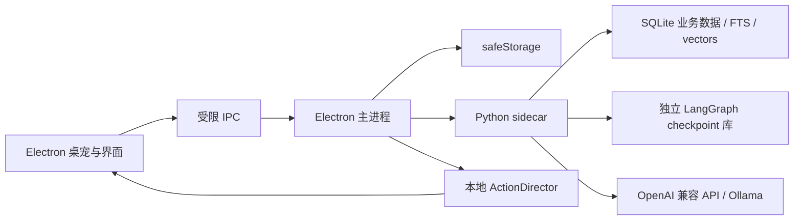

# Everby（常伴）

[English](README.en.md) | 简体中文

Everby 是一个面向 Windows 与 macOS 的本地桌面陪伴智能体。它使用 Electron 提供透明桌宠窗口和管理界面，以 Python sidecar 负责对话、工具、记忆与后台工作流，并将受控语义意图映射为本地逐帧动画。

当前版本内置原创角色 **Daily**，也能发现用户自行安装的 Petdex 角色。模型离线时，角色仍可走动、待机、响应点击和播放本地动作。


## 下载与安装

当前稳定版本是 [Everby v0.1.0](https://github.com/DoubleYellow-key/Everby/releases/tag/v0.1.0)：

| 平台 | 下载 | 说明 |
| --- | --- | --- |
| Windows x64 | [安装版](https://github.com/DoubleYellow-key/Everby/releases/download/v0.1.0/Everby.Setup.0.1.0.exe) | 推荐大多数 Windows 用户使用，可选择安装目录 |
| Windows x64 | [便携版](https://github.com/DoubleYellow-key/Everby/releases/download/v0.1.0/Everby.0.1.0.exe) | 无需安装，下载后直接运行 |
| macOS Apple Silicon | [DMG](https://github.com/DoubleYellow-key/Everby/releases/download/v0.1.0/Everby-0.1.0-arm64.dmg) | 适用于 M1、M2、M3、M4 等 Apple 芯片 |
| macOS Intel | [DMG](https://github.com/DoubleYellow-key/Everby/releases/download/v0.1.0/Everby-0.1.0.dmg) | 适用于 Intel 芯片 Mac |
| 完整性校验 | [SHA256SUMS.txt](https://github.com/DoubleYellow-key/Everby/releases/download/v0.1.0/SHA256SUMS.txt) | 校验下载文件是否完整 |

当前安装包尚未签名。Windows 出现 SmartScreen 提示时，确认文件来自本仓库后可选择“更多信息 → 仍要运行”；macOS 首次启动时可右键 Everby 选择“打开”，或前往“系统设置 → 隐私与安全性 → 仍要打开”。后续版本和全部构建产物统一发布在 [GitHub Releases](https://github.com/DoubleYellow-key/Everby/releases)。

## 主要功能

- 透明、置顶且不抢焦点的桌宠窗口，支持拖动、点击、走动和跨显示器定位
- Daily 与本地角色切换，每个角色拥有独立人设、对话记录和记忆
- Daily 的九组透明逐帧动画，包括专属的电脑敲代码动作
- OpenAI Chat Completions 兼容接口，支持流式回复、取消、超时和有限重试
- LangChain `create_agent` 与 LangGraph 状态图负责对话、工具循环、短期 checkpoint 和能力降级；每次模型配置后自动探测流式、工具与向量能力
- 对话支持选择或粘贴最多三张图片；聊天模型通过受限的 `inspect_image` 工具按需调用独立配置的视觉模型
- 对话图在生成前分析本轮响应目标，生成后经过质量门；自我介绍、重复称呼与空泛陪伴话术会被确定性修复或进入受控重写节点，再持久化到会话
- Python 后台调度负责确定性提醒、主动陪伴与长期记忆整理
- 本地计划清单、一次性或每日提醒，以及低频 AI 清单关注
- SQLite FTS5 + 向量长期记忆，以及聊天、识图、Embedding 三套独立 `safeStorage` 凭据
- 可视化动作库、默认常规状态、可新增/删除的自定义状态、按角色事件规则，以及 `.soulmotion` 扩展包管理
- 动作导演通过时间预算控制非待机占比，支持固定动作或加权动作池、状态内事件覆盖和不可用扩展动作回退；Daily 示例扩展与六条事件规则会在首次启动时初始化
- 科技黑侧栏 + 悬浮圆角内容区的管理界面（保留品牌黄作为唯一强调色）、聊天气泡和托盘控制

## 快速开始

需要 Node.js 24+、pnpm 11+ 和 Python 3.10+。

```bash
pnpm install --frozen-lockfile
python -m pip install -r agent/requirements-runtime.txt
pnpm agent:test
pnpm dev
```

首次启动后，可在管理窗口的“角色”页面切换 Daily 或本机已有的 Petdex 角色。导入新角色与动作扩展的方式见下文。

## 基本交互与个性化

- **左键点击**桌宠触发当前状态的互动动画；按住左键移动可拖拽桌宠。
- **右键点击**桌宠打开聊天；托盘图标也可以打开聊天、设置或退出应用。
- “陪伴”页可以显示/隐藏桌宠、暂停背景动作、开启主动陪伴并启动自定义状态；暂停只停止背景轮换，不影响点击、提醒和拖拽反馈。
- “角色”页可以切换角色，并分别编辑名字、对用户的称呼、角色背景、说话风格和行为边界。每个角色独立保存人设、对话、计划和记忆。
- “外观”页可以调整桌宠大小与始终置顶；位置会在拖拽后持久化，并适配多显示器工作区。

“动作”页分为四个视图：

| 视图 | 可以配置的内容 |
| --- | --- |
| 动作库 | 查看基础/扩展动作的来源、循环方式、时长和语义，并在 Canvas 或桌面上试播 |
| 状态模式 | 默认只有不可删除的“常规”状态；可创建任意自定义状态，配置活跃度、固定动作或加权动作池、单次动作时长、默认持续时间，以及状态内点击/对话/提醒动作 |
| 事件规则 | 将点击、对话语义或提醒事件映射到动作，并设置启停、触发概率、冷却时间和循环动作时长 |
| 扩展包 | 导入、启停或卸载 `.soulmotion`；扩展停用后配置仍会保留，重新启用即可恢复 |

## 导入角色与动作

### 导入角色

1. 管理窗口 → **角色** → **导入角色**，选择 Petdex 角色文件夹或 `.zip` 压缩包，校验通过后立即生效并自动切换，无需重启。
2. 也可以手动把角色目录复制到 `~/.petdex/pets/`（可用 `EVERBY_PETDEX_ROOT` 修改路径），重启后生效。

同名角色已存在时导入会被拒绝，不会覆盖；Everby 不会修改外部角色目录中的已有内容。角色格式（目录结构、pet.json、persona 人设块、8×9 动画图集）见 [docs/pet-format.md](docs/pet-format.md)。

### 导入动作扩展

新动作统一以 `.soulmotion` 扩展包追加，不修改基础角色图集：

1. 管理窗口 → **动作** → **扩展包** → **导入 .soulmotion**，选择扩展包文件即可安装。
2. 每个扩展包可按角色启用、停用或卸载；停用后动作保留在库里，但不参与播放。

扩展包的 `targetPetId` 必须与当前角色一致。动作包按角色隔离，不同角色可以使用相同的包 ID 和动作 ID，切换角色后只会显示和播放该角色自己的扩展动作。

仓库附带的 `examples/motions/daily-routines.soulmotion` 会在首次启动时为 Daily 自动安装。动作包作者可以使用 CLI 校验与打包（见“开发与验证”），格式与安全约束见 [docs/soulmotion-format.md](docs/soulmotion-format.md)。

### 用 Codex Skills 创建角色与动作包

仓库的 [`skills/`](skills/) 目录提供三个面向 Everby 资源工作流的 Codex Skill。它们不是聊天提示词模板：每个 Skill 都定义了适用场景、处理步骤、校验规则和可执行脚本，Codex 会按任务选择并完成对应工作流。

#### 安装与启用

先在 Codex 中打开 Everby 仓库，并在仓库根目录执行 `pnpm install`。然后将需要的完整 Skill 目录（必须包含 `SKILL.md` 和 `scripts/`）复制或链接到 `~/.codex/skills/`：

```powershell
# Windows PowerShell
New-Item -ItemType Directory -Force "$HOME\.codex\skills"
Copy-Item -Recurse -Force .\skills\everby-* "$HOME\.codex\skills\"
```

```bash
# macOS / Linux
mkdir -p ~/.codex/skills
cp -R skills/everby-* ~/.codex/skills/
```

安装后新建一个 Codex 任务以重新加载 Skills。日常使用时可以直接描述需求，让 Codex 根据 `description` 自动选择 Skill；需要明确指定时，在提示词开头写 `$Skill名称`。

#### 从图片创建新角色

使用 [everby-pet-from-image](skills/everby-pet-from-image/SKILL.md)。提供一张或多张角色参考图，并说明角色 ID、显示名称、画风和人设要求：

```text
$everby-pet-from-image
把这张参考图制作成 Q 版像素风 Everby 桌宠。
角色 ID 为 nu-gundam，名称为 Nu Gundam，性格冷静简练。
```

Codex 会先判断素材是可以直接重切的精灵图，还是需要重新设计的立绘；只有立绘时会先统一角色造型，再逐行制作待机、行走、挥手、跳跃、失落、伸展、工作和检查等 9 组动画。每行确认后才继续，最后清理背景溢色、组装为 8×9 图集、写入 `persona`，并运行格式校验。产物是包含 `pet.json` 与 `spritesheet.webp` 的角色目录，可在“角色 → 导入角色”中直接选择。

#### 校验并安装现成角色

使用 [everby-pet-install](skills/everby-pet-install/SKILL.md)。输入可以是 Petdex 角色文件夹或 ZIP：

```text
$everby-pet-install 校验并安装 C:\Downloads\lulu-capybara.zip
```

Codex 会定位真正的角色根目录，检查 `pet.json`、角色 ID、图集文件名和 8×9 网格尺寸。缺少清单或文件名不规范时可以修复；图集尺寸错误时会停止并报告，不会强行缩放导致切片错位。校验通过后安装到 `~/.petdex/pets/<id>`，同名角色存在时会先询问，不会静默覆盖原文件。

#### 为已有角色制作动作扩展

使用 [everby-motion-pack](skills/everby-motion-pack/SKILL.md)。说明目标角色、动作表现、触发语义以及是否循环：

```text
$everby-motion-pack
给 Daily 制作一个被连续点击时显得不耐烦的动作，单次播放，语义使用 confused。
```

Codex 会设计动作 ID 和语义，从参考素材生成或整理为 192×208 的透明帧，生成并完善 `motion.json`，再执行 `motion:build` 与 `motion:validate`。最终产物是可导入的 `.soulmotion` 文件；在“动作 → 扩展包”安装后，可以在动作库预览，并加入状态动作池或绑定到点击、对话和提醒事件。

三个 Skill 的边界是：创建完整角色用 `everby-pet-from-image`，安装或修复现成角色用 `everby-pet-install`，给已有角色追加动作才用 `everby-motion-pack`。所有脚本都应从 Everby 仓库根目录运行，只有校验结果为 `ok: true` 或 `motion:validate` 通过才算完成。

## 配置模型

在“模型”页面分别填写 OpenAI 兼容的聊天、图片理解与 Embedding 服务。三者可以使用不同地址、模型和独立加密 API Key：

| 设置 | OpenAI 示例 | Ollama 示例 |
| --- | --- | --- |
| API Base URL | `https://api.openai.com/v1` | `http://127.0.0.1:11434/v1` |
| 模型 | `gpt-4.1-mini` | `llama3.2:latest` |
| API Key | 服务商提供的 Key | `ollama` |

本地 Ollama 测试：

```bash
ollama pull llama3.2:latest
ollama serve
EVERBY_MODEL=llama3.2:latest pnpm agent:smoke
```

API Key 由 macOS Keychain 或 Windows DPAPI 加密保存，不会通过 IPC 返回给渲染进程，也不应写入 `.env` 或提交到仓库。

配置并测试图片理解模型后，可在聊天框选择图片或直接粘贴截图。Electron 会先校验格式并压缩图片，不向模型暴露本地路径。图片不会自动绕过对话工作流：支持工具调用的聊天模型会在回答依赖画面时调用 `inspect_image`，视觉观察结果再回到主模型生成最终回复。

## 计划与提醒

可在管理窗口的“计划”页面添加、完成或删除清单项，并分别设置截止时间和提醒时间。提醒支持一次性与每日重复；即使模型离线，到点后的系统通知、桌宠气泡和本地响应仍然可用。

也可以直接在对话中提出“下午三点提醒我喝水”“把整理周报加入计划”或“完成整理周报”。Python 智能体只暴露新增与完成工具，不提供删除工具；完成项目前必须先查询准确 ID。模型不支持工具调用时会降级为纯陪伴聊天，已有记忆召回仍可用。

真正的提醒时间由 Python 调度器基于 SQLite 时间戳确定，不交给模型判断。到期后模型只负责按角色口吻润色提醒文案；模型不可用时使用确定性文案。系统通知、桌宠气泡和提醒动作由同一个到期事件触发，避免聊天结果与主动事件重复播放。AI 清单关注只处理临近或逾期的截止时间，不会把尚未到期的独立提醒误报为“时间到了”。

## 智能体与记忆

### LangGraph 对话工作流

主对话由 Python 中的显式状态图执行：

```text
load_context -> analyze_turn -> hybrid_memory_recall -> capability_route
             -> companion_agent / direct_chat
             -> reply_quality_gate -> repair_reply / rewrite_reply
             -> persist_turn -> select_action -> enqueue_memory_curation
```

`analyze_turn` 先确定本轮是普通陪伴、回答问题还是执行操作；生成后的质量门会检查重复自我介绍、重复称呼、空泛陪伴话术和“未执行工具却声称成功”等问题。完整工具路径使用 LangChain `create_agent`，工具循环递归上限为 10（超限时会返回明确的降级回复而不是发送失败），每轮最多 2 个写操作并设置 45 秒超时；待办写入以 `run_id + tool_call_id` 幂等，长期事实通过精确内容或向量相似度去重。

模型默认只能使用七个受限陪伴工具；视觉能力探测成功后按条件增加一个识图工具：

| 工具 | 用途 |
| --- | --- |
| `get_current_time` | 获取用户时区下的当前日期、时间和时间戳 |
| `list_todos` | 查询当前角色的计划，并为完成操作取得准确 ID |
| `create_todo` | 新增计划或提醒，自动复用同名未完成项并补齐缺失时间 |
| `complete_todo` | 按准确 ID 完成计划，调用前必须先执行 `list_todos` |
| `search_memories` | 在自动召回不足时搜索当前角色的长期记忆 |
| `remember_memory` | 仅在用户明确要求“记住”时立即保存长期事实 |
| `request_pet_action` | 每轮最多请求一次语义动作；不接受具体动画 ID，由 Electron `ActionDirector` 选择可用动画 |
| `inspect_image` | 仅识别本轮用户主动附加的图片，通过独立视觉模型返回不可信的视觉观察 |

模型没有删除计划、删除记忆、具体动画选择、文件、Shell、应用控制或任意网络工具。流式、工具调用、图片理解和 Embedding 能力会分别探测；不支持原生工具调用时进入 `direct_chat`，陪伴聊天和已有记忆召回仍可用，并通过确定性关键词逻辑降级选择动作；原生工具循环、识图与自动记忆整理会停用。

### 短期与长期记忆

- **短期记忆**：每个角色和会话 epoch 使用独立的 LangGraph thread ID，并由 `AsyncSqliteSaver` 保存到单独 checkpoint 数据库。上下文达到约 4,000 tokens 时自动摘要旧消息，保留最近 20 条。清空会话会递增 epoch，不会删除长期记忆。
- **长期记忆**：包含偏好、身份、目标、项目、习惯、关系与约定七种结构化事实。明确说“记住”会立即写入；支持工具调用的模型完成回复后，会经过 30 秒防抖，从最近 6 条消息中异步整理稳定事实。
- **安全过滤**：凭据、密码、API Key、一次性闲聊和模型推测的敏感属性不会写入长期记忆。相同类型且向量相似度达到 `0.92` 的事实会合并更新。
- **混合检索**：SQLite FTS5 与存储为 float32 BLOB 的向量各取前 8 条，通过 RRF（`k=60`）融合后返回前 5 条；Embedding 不可用时自动保留 FTS 检索，不阻塞聊天。
- **可视化管理**：“记忆”页显示类型、置信度、创建时间与向量索引状态，支持删除单条或清空当前角色的全部长期记忆。

## 架构



- `electron/`：窗口生命周期、IPC、安全存储、角色目录和动作包服务
- `agent/`：Python LangChain/LangGraph 智能体、工具、记忆、持久化、调度和 protocol v2
- `src/core/`：动作导演、状态配置、播放队列、时间线与语义意图映射
- `src/renderer/`：桌宠、聊天和管理界面
- `resources/runtime-pets/`：可随应用分发的内置角色资源
- `resources/pet-qa/`：原创角色的动画检查图与验证结果
- `docs/`：动作扩展格式等开发文档

## 开发与验证

```bash
pnpm typecheck       # TypeScript 类型检查
pnpm test            # Vitest 单元与集成测试
pnpm test:e2e        # Playwright Electron 端到端测试
pnpm agent:test      # Python 智能体测试
pnpm build           # Electron 渲染与主进程构建
```

开发态由 Electron 启动 `python3 agent/main.py`。可使用 `EVERBY_PYTHON` 指定 Python 解释器。

动作扩展格式和安全约束见 [docs/soulmotion-format.md](docs/soulmotion-format.md)：

```bash
pnpm motion:validate -- path/to/motion.soulmotion
pnpm motion:build -- path/to/motion-directory output.soulmotion
```

## 发布安装包

GitHub Actions 会在推送与 `package.json` 版本一致的 `v*.*.*` 标签时创建 GitHub Release，并上传：

- Windows x64：NSIS 安装版与便携版 `.exe`
- macOS Apple Silicon：`.dmg` 与 `.zip`
- macOS Intel：`.dmg` 与 `.zip`
- `SHA256SUMS.txt`：全部发布文件的 SHA-256 校验值

```bash
# 先修改 package.json 中的 version，例如 0.1.0
git tag v0.1.0
git push origin v0.1.0
```

也可以在 GitHub 的 **Actions → Publish desktop release → Run workflow** 中输入一个已经存在的标签重新发布。当前产物未配置商业代码签名：Windows 可能显示 SmartScreen 提示，macOS 可能要求右键选择“打开”；正式大范围分发前建议配置 Windows 签名证书与 Apple Developer ID 公证。

角色格式（目录结构、pet.json、8×9 图集网格）见 [docs/pet-format.md](docs/pet-format.md)；用 AI 创建角色与动作包的三个 Codex skills 见上文“导入角色与动作”。

后续角色动作统一以 `.soulmotion` 扩展包追加，不直接修改基础角色图集。模型只输出语义意图，Electron 的 `ActionDirector` 统一处理状态时间预算、动作权重、事件优先级和回退。默认只有不可删除的“常规”状态，用户可以创建带独立时长、背景动作池以及点击、对话、提醒动作的自定义状态。左键点击桌宠播放互动动作，左键移动用于拖拽，右键打开聊天。

## 打包

发布构建需要先安装 PyInstaller：

```bash
python -m pip install -r agent/requirements-build.txt
pnpm dist:mac:arm64
pnpm dist:mac:x64
pnpm dist:win
```

PyInstaller 不支持跨系统或跨架构编译，请在对应的 runner 上构建。`.github/workflows/build.yml` 会在推送到 `main` 时分别验证 macOS arm64、macOS x64 与 Windows x64，并依次运行 Python 测试、类型检查、Vitest 和打包。当前第一版不包含代码签名、自动更新和安装包公证。

## 数据与隐私

应用数据位于 Electron `userData` 目录。Python 独占消息、人设、待办、记忆与工作流数据，并使用同目录的独立 SQLite 文件保存 LangGraph checkpoint，避免与业务写入争抢锁；Electron 只保存桌面设置、动作包和模型非机密配置。聊天、图片理解与 Embedding API Key 分别通过 `safeStorage` 加密，启动后仅送入 Python 内存。前台应用感知默认关闭；开启后只读取应用名称，不读取窗口标题、URL、文件名、屏幕或窗口内容，且应用名称不会写入数据库。

锁屏、暂停和免打扰期间不会触发主动模型调用。前台应用感知可以随时在“隐私”页面关闭。

## 角色资源

Daily 是 Everby 的原创内置角色，其运行图集与 QA 资料保存在本仓库。完整九组动作可在 [Daily 动作检查图](resources/pet-qa/daily/contact-sheet.png) 中查看。

外部角色资源不包含在 Everby 的授权范围内，也不会被复制进源码仓库。贡献或发布其他角色前，请先确认对应素材的授权范围。

## 常见问题

- **能聊天但不能创建计划**：在“模型”页点击“探测能力”。模型不支持原生 tool calling 时会显示降级状态；可更换支持工具调用的 OpenAI 兼容模型。
- **图片可以附加但无法识别**：先保存并测试图片理解模型，同时确认聊天模型的工具调用探测通过；`direct_chat` 降级模式不会执行识图工具。
- **动作扩展已安装但没有播放**：确认当前角色与扩展的 `targetPetId` 一致、扩展已启用，并在动作库试播；事件动作还需要加入状态覆盖或事件规则。
- **Python sidecar 无法启动**：确认已安装 `agent/requirements-runtime.txt`，并通过 `EVERBY_PYTHON` 指向 Python 3.10+ 解释器。
- **角色或动作包导入失败**：分别运行 `everby-pet-install` 的校验脚本或 `pnpm motion:validate` 查看具体尺寸、清单和资源路径错误。

## 参与贡献

欢迎通过 Issue 或 Pull Request 提交问题、功能和文档改进。提交前请至少运行 `pnpm agent:test`、`pnpm typecheck`、`pnpm test` 和 `pnpm build`；涉及 Electron 交互时补充 `pnpm test:e2e`，涉及 `.soulmotion` 时附上 `pnpm motion:validate` 结果。角色或动作素材必须说明来源与许可，不要提交无法确认授权的第三方 IP 资源。

## 当前状态

Everby 仍处于第一版开发阶段。建议在公开发布前补充代码签名和安装包公证，并通过 GitHub Release 分发构建产物，不要把 `release/` 直接提交到源码仓库。

## 许可证

Everby 源码与仓库内的原创 Daily 资源采用 [MIT License](LICENSE)。通过 Petdex 单独安装的角色及其他明确标注的第三方资源不包含在该授权范围内，请遵循各自的许可条款。
