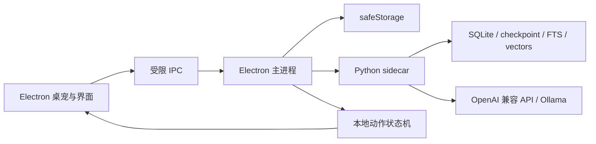

# SoulDesk

SoulDesk 是一个面向 Windows 与 macOS 的本地桌面陪伴智能体。它使用 Electron 提供透明桌宠窗口和管理界面，以 Python sidecar 负责对话、工具、记忆与后台工作流，并将受控语义意图映射为本地逐帧动画。

当前版本内置原创角色 **Daily**，也能发现用户自行安装的 Petdex 角色。模型离线时，角色仍可走动、待机、响应点击和播放本地动作。


## 主要功能

- 透明、置顶且不抢焦点的桌宠窗口，支持拖动、点击、走动和跨显示器定位
- Daily 与本地角色切换，每个角色拥有独立人设、对话记录和记忆
- Daily 的九组透明逐帧动画，包括专属的电脑敲代码动作
- OpenAI Chat Completions 兼容接口，支持流式回复、取消、超时和有限重试
- LangChain `create_agent` 与 LangGraph 状态图负责对话、工具循环、短期 checkpoint 和能力降级
- Python 后台调度负责确定性提醒、主动陪伴与长期记忆整理
- 本地计划清单、一次性或每日提醒，以及低频 AI 清单关注
- SQLite FTS5 + 向量长期记忆与 Electron `safeStorage` 双 API Key 保护
- `.soulmotion` 动作扩展包的验证、安装、启停和卸载
- 黄色与白色为主的管理界面、聊天气泡和托盘控制

## 快速开始

需要 Node.js 24+、pnpm 11+ 和 Python 3.10+。

```bash
pnpm install --frozen-lockfile
python -m pip install -r agent/requirements-runtime.txt
pnpm agent:test
pnpm dev
```

首次启动后，可在管理窗口的“角色”页面切换 Daily 或本机已有的 Petdex 角色。SoulDesk 只读扫描 `~/.petdex/pets`，不会修改外部角色的安装目录或原始资源。

## 配置模型

在“模型”页面分别填写 OpenAI 兼容的聊天与 Embedding 服务。Embedding 使用独立配置和独立加密 API Key：

| 设置 | OpenAI 示例 | Ollama 示例 |
| --- | --- | --- |
| API Base URL | `https://api.openai.com/v1` | `http://127.0.0.1:11434/v1` |
| 模型 | `gpt-4.1-mini` | `llama3.2:latest` |
| API Key | 服务商提供的 Key | `ollama` |

本地 Ollama 测试：

```bash
ollama pull llama3.2:latest
ollama serve
SOULDESK_MODEL=llama3.2:latest pnpm agent:smoke
```

API Key 由 macOS Keychain 或 Windows DPAPI 加密保存，不会通过 IPC 返回给渲染进程，也不应写入 `.env` 或提交到仓库。

## 计划与提醒

可在管理窗口的“计划”页面添加、完成或删除清单项，并分别设置截止时间和提醒时间。提醒支持一次性与每日重复；即使模型离线，到点后的系统通知、桌宠气泡和本地响应仍然可用。

也可以直接在对话中提出“下午三点提醒我喝水”“把整理周报加入计划”或“完成整理周报”。Python 智能体只暴露新增与完成工具，不提供删除工具；完成项目前必须先查询准确 ID。模型不支持工具调用时会降级为纯陪伴聊天，已有记忆召回仍可用。

## 架构



- `electron/`：窗口生命周期、IPC、安全存储、角色目录和动作包服务
- `agent/`：Python LangChain/LangGraph 智能体、工具、记忆、持久化、调度和 protocol v2
- `src/core/`：时间线与动作意图映射
- `src/renderer/`：桌宠、聊天和管理界面
- `resources/runtime-pets/`：可随应用分发的内置角色资源
- `resources/pet-qa/`：原创角色的动画检查图与验证结果
- `docs/`：动作扩展格式等开发文档

## 开发与验证

```bash
pnpm typecheck       # TypeScript 类型检查
pnpm test            # Vitest 单元与集成测试
pnpm test:e2e        # Playwright Electron 端到端测试
pnpm agent:test      # Python 智能体测试
pnpm build           # Electron 渲染与主进程构建
```

开发态由 Electron 启动 `python3 agent/main.py`。可使用 `SOULDESK_PYTHON` 指定 Python 解释器。

动作扩展格式和安全约束见 [docs/soulmotion-format.md](docs/soulmotion-format.md)：

```bash
pnpm motion:validate -- path/to/motion.soulmotion
pnpm motion:build -- path/to/motion-directory output.soulmotion
```

后续角色动作统一以 `.soulmotion` 扩展包追加，不直接修改基础角色图集。模型和提醒系统只选择语义意图，具体动画由当前角色已启用的基础动作与扩展动作映射器决定。

## 打包

发布构建需要先安装 PyInstaller：

```bash
python -m pip install -r agent/requirements-build.txt
pnpm dist:mac:arm64
pnpm dist:mac:x64
pnpm dist:win
```

PyInstaller 不支持跨系统或跨架构编译，请在对应的 macOS 或 Windows runner 上构建。GitHub Actions 工作流位于 `.github/workflows/build.yml`。当前第一版不包含代码签名、自动更新和安装包公证。

## 数据与隐私

应用数据位于 Electron `userData` 目录。Python 独占消息、人设、待办、记忆、工作流和 checkpoint 表；Electron 只保存桌面设置、动作包和模型非机密配置。聊天与 Embedding API Key 分别通过 `safeStorage` 加密，启动后仅送入 Python 内存。前台应用感知默认关闭；开启后只读取应用名称，不读取窗口标题、URL、文件名、屏幕或窗口内容，且应用名称不会写入数据库。

锁屏、暂停和免打扰期间不会触发主动模型调用。前台应用感知可以随时在“隐私”页面关闭。

## 角色资源

Daily 是 SoulDesk 的原创内置角色，其运行图集与 QA 资料保存在本仓库。完整九组动作可在 [Daily 动作检查图](resources/pet-qa/daily/contact-sheet.png) 中查看。

外部角色资源不包含在 SoulDesk 的授权范围内，也不会被复制进源码仓库。贡献或发布其他角色前，请先确认对应素材的授权范围。

## 当前状态

SoulDesk 仍处于第一版开发阶段。建议在公开发布前补充代码签名和安装包公证，并通过 GitHub Release 分发构建产物，不要把 `release/` 直接提交到源码仓库。

## 许可证

SoulDesk 源码与仓库内的原创 Daily 资源采用 [MIT License](LICENSE)。通过 Petdex 单独安装的角色及其他明确标注的第三方资源不包含在该授权范围内，请遵循各自的许可条款。
